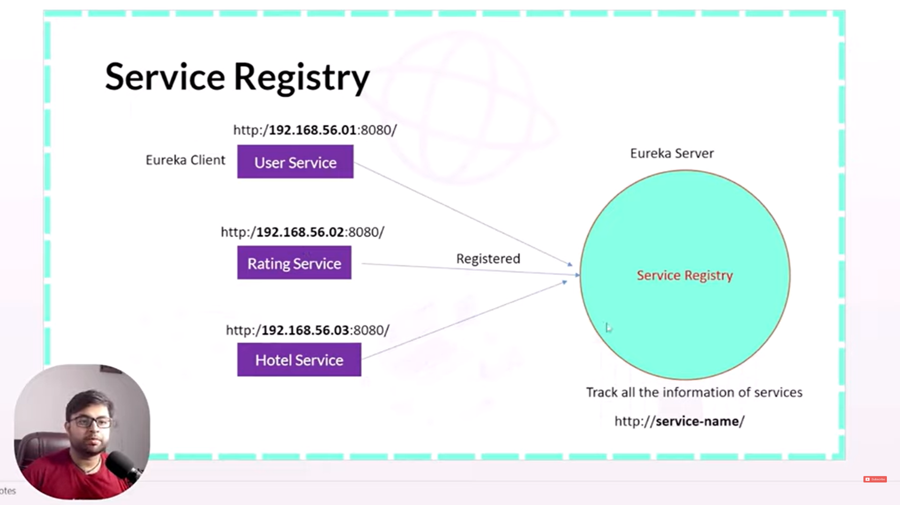

### Eureka Server / Service Registry

1. Here we created one application where we included following two dependencies to appoint this service as a eureka server.
```
implementation 'org.springframework.cloud:spring-cloud-starter'
implementation 'org.springframework.cloud:spring-cloud-starter-netflix-eureka-server'  
```

2. Apart from adding above two dependencies we need to add few other configurations as well like Dependency management and spring cloud version.
3. Apply **@EnableEurekaServer** in our main class.
4. Few other properties in application.yaml file -
```
eureka:
  instance:
    hostname: localhost
  client:
    register-with-eureka: false           # these two properties defined and set to false otherwise this service
    fetch-registry: false                 # itself will be registered with eureka server, but we don't want this,
                                          # we want to register other services on this server.
server:
  port: 8761
```

### Flow Diagram


1. Microservices registered to this eureka server -
    1. [Hotel microservice](https://github.com/ayushdgupta/SpringBoot3-Hotel-Microservice).
    2. [User microservice](https://github.com/ayushdgupta/SpringBoot3-User-Microservice/tree/master).
    3. [Rating microservice](https://github.com/ayushdgupta/SpringBoot3-Rating-Microservice).